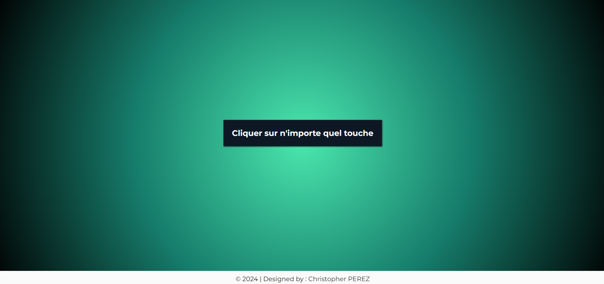
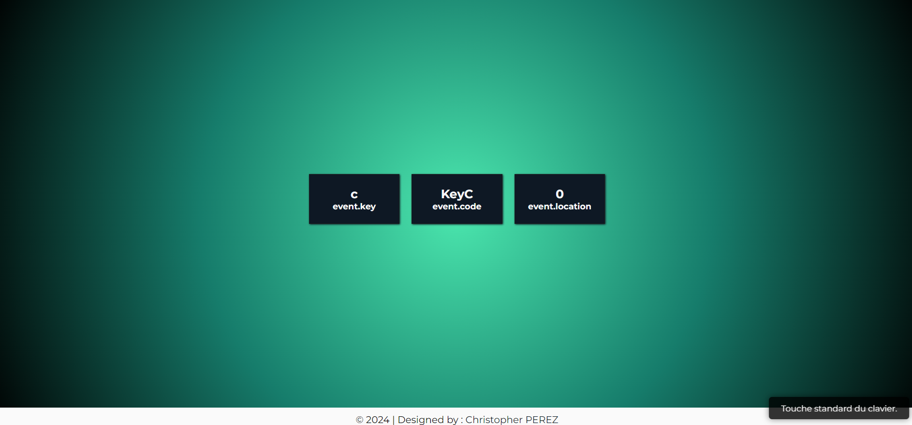

# :flower_playing_cards: Event Keycodes

Ce projet interactif permet à l'utilisateur d'afficher des informations en temps réel sur les touches du clavier qu'il presse. Chaque fois qu'une touche est enfoncée, des informations telles que la touche elle-même, son code et sa localisation sont affichées dynamiquement à l'écran. Il inclut également une notification pop-up qui explique succinctement la localisation de la touche.
Il a été réalisé dans le cadre d'une formation sur [Udemy](https://www.udemy.com/course/50-projects-50-days/).

## Fonctionnalités

- **Affichage dynamique des touches du clavier** : Lorsque l'utilisateur presse une touche, les informations concernant <b>event.key</b>, <b>event.code</b>, et <b>event.location</b> s'affichent en temps réel.
- **Pop-up explicatif** : Lors de la pression sur une touche, un petit pop-up s'affiche temporairement pour fournir une explication claire sur la localisation de la touche.

### Technologies Utilisées

#### Structure du projet

Ce projet est le onzième d'une série dans laquelle je me donne l'objectif de perfectionner mes compétences en JavaScript.

Ce projet est un exercice visant à perfectionner l'utilisation des événements clavier (keydown) avec JavaScript, ainsi que l'affichage dynamique d'informations dans une page web.

- **index.html** : Contient la structure principale de l'application, avec une section pour afficher les informations des touches du clavier pressées.
- **style.css** : Gère le style et la mise en page de l'interface, assurant un design clair et épuré.
- **script.js** : Contient la logique JavaScript qui capte l'événement keydown et affiche dynamiquement les informations associées à la touche. Il gère également l'affichage du pop-up explicatif concernant la localisation des touches.

